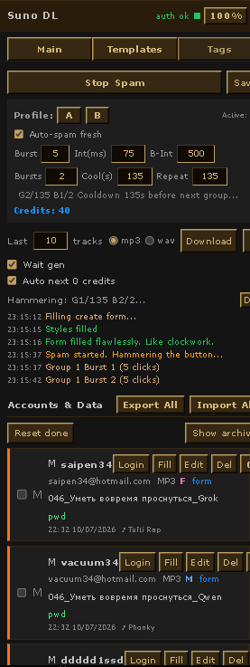
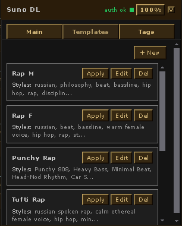
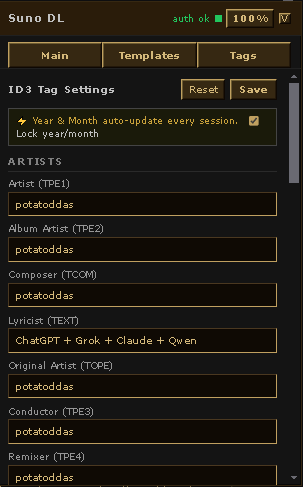

<div align="center">

# 🎵 Suno Downloader

**The most powerful Tampermonkey userscript for [suno.com](https://suno.com)**
Multi-account OAuth automation · Batch MP3/WAV download · Full ID3v2 tagging · Lyrics injection

[](suno_downloader1.js)
[](https://www.tampermonkey.net/)
[](LICENSE)

</div>

---

## 🌟 What is This?

**Suno Downloader** is a full-featured Tampermonkey userscript that transforms [suno.com](https://suno.com) into a production-ready music pipeline.

It was built for power users who:
- Run **multiple Suno accounts** and need to rotate through them automatically
- Generate songs at scale and need **batch downloads** with proper ID3 metadata embedded
- Want **lyrics auto-injected** into the Suno create form on each login
- Need clean, properly tagged MP3s ready for DAWs, streaming, and archiving

The widget lives as a **floating dark panel** on the Suno page — Windows 95 Vintage aesthetic, drag-anywhere, collapsible — and handles everything from OAuth login automation to per-track ID3 frame embedding.

---

## ✨ Feature Overview

### 🤖 Multi-Account Automation
- Store unlimited **Google / Microsoft OAuth** accounts
- One-click **chain login** — logs out current session, auto-logs into the next account
- Full OAuth flow automation: navigates Google account chooser, Microsoft login screens, password entry, consent pages
- Persistent login watchdog prevents getting stuck mid-flow
- Emergency reset hotkey `Ctrl+Shift+Alt+R`

### ⬇️ Batch Download
- Download **last N tracks** (1–200) per account
- Formats: **MP3** and **WAV** (with WAV URL auto-detection from CDN)
- Waits for in-progress AI generations to finish before downloading
- Progress bar + per-track timestamped log
- Cancel button works mid-batch

### 🏷️ Full ID3v2 Tagging
Every downloaded MP3 is tagged with **20+ ID3v2 frames**:

| Frame | Field |
|-------|-------|
| `TIT2` | Track title (from Suno API metadata) |
| `TPE1` | Artist |
| `TPE2` | Album Artist |
| `TCOM` | Composer |
| `TEXT` | Lyricist |
| `TPE3` / `TPE4` | Conductor / Remixer |
| `TALB` | Album |
| `TPOS` | Disc number |
| `TYER` / `TDRC` | Year / Date (auto-updated monthly) |
| `TORY` | Original year |
| `TCON` | Genre |
| `TMOO` | Mood |
| `USLT` | Embedded lyrics |
| `COMM` | Comment |
| `WOAR` / `WOAS` / `WPUB` / `WXXX` | Artist / Source / Publisher / Custom URLs |
| `TBPM` | BPM |
| `TKEY` | Key |
| `TLAN` | Language |
| `TSRC` | ISRC |
| `TCOP` / `TPUB` / `TENC` / `TSSE` | Copyright / Publisher / Encoded by / Tool |

### 🎤 Lyrics Injection
Automatically fills the Suno **create form** with lyrics and style on login:
- **3-tier injection engine** for Lexical/ProseMirror editor:
  1. Clipboard `paste` event via `DataTransfer` (primary — most reliable)
  2. `execCommand('insertText')` fallback
  3. Direct `innerText` manipulation as last resort
- Automatic retry if React re-renders wipe the field
- Per-account lyrics + style presets
- **Template system** — save named lyrics/style combos, pick with one click

### 🔥 Spam / Credit Drain Engine
Automatically submits song generation requests to burn credits efficiently:
- Configurable **burst size**, **burst interval**, **burst-group interval**
- **Cooldown timer** between groups
- **Auto-spam on fresh credits** — starts when ≥45 credits detected
- Out-of-credits detection → auto-advances to next account in chain
- **Profile A/B** — two independent spam configs, switch instantly

### 🗂️ Smart Tag Panel (NEW in v9.1.0)
Dedicated **Tags tab** in the widget UI:
- Edit all 20+ ID3 fields directly in the widget — no code editing required
- **Year/Month auto-update** every session (always reflects current date)
- **Lock year/month** toggle to freeze them manually
- Save / Reset buttons with flash feedback
- All settings persisted to Tampermonkey storage — survive page reloads and browser restarts

---

## 📸 Screenshots

### Main Tab


### Templates Tab


### Tags Tab


---

## 📦 Installation

### Requirements
- **Tampermonkey** for Chrome, Firefox, Edge, or Opera
  → [Get Tampermonkey](https://www.tampermonkey.net/)

### Steps

1. Open Tampermonkey dashboard → **Create a new script**
2. Delete all template content
3. Copy the full contents of [`suno_downloader1.js`](suno_downloader1.js)
4. Paste and press **Save** (`Ctrl+S`)
5. Navigate to [suno.com](https://suno.com) — the dark widget appears bottom-right

> The script requires `@connect *` permission for audio downloads. Tampermonkey will ask once — click **Allow**.

---

## 🎛️ Widget UI Tour

```
┌──────────────────────────────────────────┐
│ Suno DL   [no auth ●]  [100%]  [V]       │  ← Drag header to move
├──────────────────────────────────────────┤
│  [Main]  [Templates]  [Tags]             │  ← Three tabs
├──────────────────────────────────────────┤
│  [Start Spam]                  [Save]    │
│  Profile: [A] [B]   Active: A            │
│  □ Auto-spam fresh                       │
│  Burst [5]  Int(ms) [75]  B-Int [500]    │
│  Bursts [2]  Cool(s) [60]  Repeat [999]  │
│  Credits: 45                             │
│ ──────────────────────────────────────── │
│  Last [10] tracks  ● mp3  ○ wav          │
│  [Download]                     [X]      │
│  □ Wait gen   □ Auto next 0 credits      │
│ ━━━━━━━━━━━━━━━━━━━━━━━━  0%            │
│  Waiting...                     [Del]    │
│  12:34:01  Track 01 downloaded ✓         │
│ ──────────────────────────────────────── │
│  Accounts & Data   [Export All][Import]  │
│  [Reset done]            [Show archive]  │
│  ┌──────────────────────────────────┐   │
│  │ G  myemail@gmail.com    mp3      │   │
│  │    [Login][Fill][Edit][Del][ON]  │   │
│  └──────────────────────────────────┘   │
│  [+ Add Account]                         │
└──────────────────────────────────────────┘
```

| Tab | Purpose |
|-----|---------|
| **Main** | Download controls, spam engine, account list |
| **Templates** | Save and pick named lyrics + style presets |
| **Tags** | Edit all ID3 tag fields live |

---

## 👤 Account Fields

| Field | Description |
|-------|-------------|
| **Provider** | `google` or `microsoft` |
| **Email** | Must match exactly what appears in the OAuth account chooser |
| **Password** | Auto-filled on the password screen |
| **Format** | Per-account download format: `mp3` or `wav` |
| **Lyrics** | Injected into the Suno lyrics field on auto-login |
| **Styles** | Injected into the style/genre field |
| **Voice** | Auto-clicks `male` or `female` voice button |
| **Song Name** | Pre-fills the song title input |
| **Auto-fill** | Toggle: auto-fill the create form every time this account logs in |
| **Enabled/Done** | Skip done accounts; toggle enabled/disabled without deleting |

---

## 🔑 OAuth Auto-Login Flow

### Google OAuth
1. Detects `accounts.google.com` — reads target account from stored state
2. Finds and clicks the correct account tile by email match (case-insensitive)
3. If no tile → clicks "Use another account" → fills email → Next
4. Detects password screen → fills password → Next
5. Consent page → auto-clicks Allow
6. Returns to Suno → Clerk token captured → proceeds to form fill + download

### Microsoft OAuth
1. Detects `login.microsoftonline.com` / `login.live.com`
2. Handles "Choose an account" screen with multiple selector strategies
3. Handles FIDO/passkey prompts → clicks "Sign in another way"
4. Fills email on fresh login screens, fills password on password screens
5. Handles "Stay signed in?" prompt → clicks Yes
6. Validates `prompt=select_account` in OAuth URLs to prevent wrong-account sessions

Both watchdogs run on 1-second polling with a 45-second timeout and clean up automatically after success or failure.

---

## 🏷️ ID3 Tag System

### Smart Auto-Dating
`year` and `date` (month) **auto-update to today** every session by default — no manual maintenance needed. Tags on every downloaded file are always current.

Enable **"Lock year/month"** in the Tags tab to freeze them to specific values.

### All Supported Frames

```
Artists:     TPE1 (artist), TPE2 (album_artist), TCOM (composer),
             TEXT (lyricist), TOPE (original_artist),
             TPE3 (conductor), TPE4 (remixer)

Release:     TALB (album), TPOS (disc/total)

Date:        TYER (year), TDRC (year-month), TORY (original_year)

Genre/Mood:  TCON (genre), TMOO (mood)

Rights:      TCOP (copyright), TPUB (publisher),
             TENC (encoded_by), TSSE (encoding_tool), TSRC (isrc)

Comment:     COMM with language code

Lyrics:      USLT — from Suno API metadata OR account lyrics field

URLs:        WXXX (custom url), WOAR (artist url),
             WOAS (audio source), WPUB (publisher url)

Tech:        TBPM (bpm), TKEY (key), TLAN (language)

Title:       TIT2 — always from actual track name in Suno API
```

---

## ⚡ Spam Engine Reference

```
Wave structure:
  ┌─ Group 1 ─────────────────────────────────┐
  │  Burst 1: ■■■■■ (burstSize × requests)     │
  │           ↑ burstInterval ms between each  │
  │  ← burstGroupInterval ms wait →            │
  │  Burst 2: ■■■■■                             │
  └────────────────────────────────────────────┘
  ← cooldown seconds →
  ┌─ Group 2 ─────────────────────────────────┐
  │  ... (repeats totalGroups times)           │
  └────────────────────────────────────────────┘
```

| Setting | Default | Description |
|---------|---------|-------------|
| **Burst** | 5 | Requests per burst |
| **Int(ms)** | 75 | Delay between requests within a burst |
| **B-Int** | 500 | Delay between bursts within a group |
| **Bursts** | 2 | Number of bursts per group |
| **Cool(s)** | 60 | Cooldown between groups |
| **Repeat** | 999 | Total groups before stopping |

---

## 💾 Data Management

### Export / Import
**Export All** — saves complete state to a JSON file:  
accounts, passwords, lyrics, spam profiles, auth tokens, templates, widget settings

**Import All** — restores from JSON, overwrites all current state, reloads page

### GM Storage Keys

| Key | Contents |
|-----|----------|
| `snd_accounts` | Account list |
| `snd_auto` | Current automation state machine |
| `snd_auth` | Captured Clerk auth JWT |
| `snd_tag_settings` | ID3 tag fields |
| `snd_templates` | Lyrics/style templates |
| `snd_spam_profiles` | Profiles A and B |
| `snd_spam_active_profile` | Active profile |
| `snd_widget_pos` | Widget position |
| `snd_widget_collapsed` | Collapsed state |
| `snd_widget_opacity` | Opacity level |

---

## 🛠️ Technical Architecture

### Network Interception
Hooks `fetch` at `document-start` to intercept calls to `studio-api-prod.suno.com`.  
Captures `Authorization`, `browser-token`, and `device-id` headers → stored for API calls.

### MP3 Tagging Pipeline
```
Track URL
  → GM_xmlhttpRequest (blob response)
  → FileReader.readAsArrayBuffer
  → BrowserID3Writer (v4.4.0 via CDN)
  → setFrame × 20+ (all ID3v2 frames)
  → writer.addTag()
  → Blob → Object URL → <a>.click() → browser downloads file
```

### Lyrics Injection (Lexical Editor)
Suno uses [Lexical](https://lexical.dev/) — a React-controlled `contenteditable` that ignores `element.value` assignment. The 3-tier injection:
```
1. new DataTransfer() + ClipboardEvent('paste')
   → Lexical handles it through its own paste plugin (best)
2. execCommand('selectAll') + execCommand('insertText', text)
   → Still works in extension contexts despite deprecation
3. el.innerText = text + InputEvent('input')
   → Bypasses React; last resort
```

### Widget Resilience
Protected against Suno's SPA navigation (React Router):
- `MutationObserver` on `documentElement` → recreates widget if DOM-removed
- `history.pushState` / `replaceState` hooks → re-checks presence
- `popstate` listener → same
- `setInterval(safeCreateWidget, 2000)` → ultimate fallback

---

## ⌨️ Hotkeys

| Shortcut | Action |
|----------|--------|
| `Ctrl+Shift+Alt+R` | Emergency reset — clears stuck login state |

---

## ❗ Troubleshooting

| Problem | Fix |
|---------|-----|
| Widget not appearing | Check Tampermonkey is enabled for suno.com; try `Ctrl+Shift+Alt+R` |
| Login stuck | Click red RESET button (top-right); watchdog times out at 45s |
| Downloads fail | Auth may be expired — click Login on the account |
| Lyrics not injecting | Must be on `/create` page; script waits 15s for editor |
| ID3 tags missing | WAV format has no tagging; MP3 only |
| Wrong account selected | Ensure email in account settings matches exactly what Google/MS shows |

---

## 🔒 Privacy

- **No external servers** — all data in Tampermonkey local storage only
- **No telemetry, no analytics, no callbacks** to third parties
- Credentials stored locally in `GM_setValue` — use Export to back them up
- Auth tokens only used for Suno's own API endpoints

---

## 📋 Changelog

### v9.1.0
- **NEW** Full ID3v2 smart tagging — 20+ frames written to every MP3
- **NEW** Tags tab in widget — edit all fields, auto-updating year/month with lock toggle
- **FIX** Lyrics injection rewritten with 3-tier Lexical/ProseMirror-compatible engine
- **FIX** Track `TIT2` (title) now correctly embedded from actual track name
- **FIX** Expanded `waitForCreateForm` selectors for current Suno editor variants
- **IMPROVE** `embedMetadataIntoMp3` now writes full frame set (was only 5 before)

### v9.0.4
- Google OAuth watchdog fully rewritten — matches Microsoft watchdog reliability
- Password detection improved for both providers
- Consent page auto-detection and auto-Allow

### v9.0.x
- Multi-account chain login system
- Spam engine with Profile A/B
- Template system for lyrics/styles
- WAV download support
- Emergency reset UI + hotkey
- Export/Import full state to JSON

---

## 📄 License

MIT — use it, fork it, improve it.

---

<div align="center">

Made with ☕ and rage  
**[suno.com](https://suno.com)** · **[@potatoddas](https://www.youtube.com/@potatoddas)**

</div>
