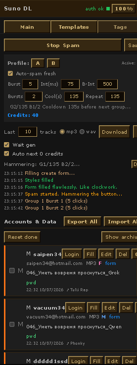
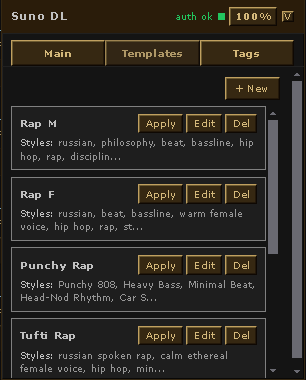
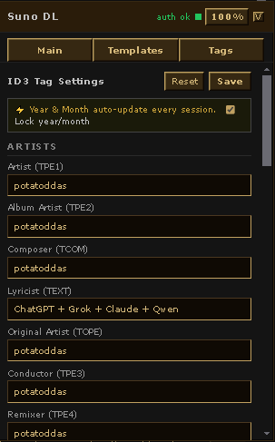

# 🎵 Suno Downloader

**Tampermonkey userscript for [suno.com](https://suno.com)**

[🤍 Support Developer](https://buymeacoffee.com/vacuum34)

Multi-account OAuth automation · Batch MP3/WAV download · Full ID3v2 tagging · Lyrics injection

---

## What it does

A floating widget on suno.com that handles:

- **Multi-account login** — stores Google/Microsoft OAuth accounts, auto-navigates the full login flow (account chooser → password → consent), then chains to the next account automatically
- **Batch download** — fetches the last N tracks per account as MP3 or WAV, waits for in-progress generations to finish, embeds metadata into every file
- **Full ID3v2 tagging** — 20+ frames written into every MP3: artist, album, year/month (auto-updated), genre, mood, lyrics, comment, BPM, URLs, ISRC, and more
- **Lyrics injection** — fills the Suno create form with lyrics + styles on login; uses a 3-tier approach to handle Suno's Lexical rich-text editor
- **Spam engine** — fires song generation requests in configurable burst waves with cooldowns and auto-starts on fresh credits; two independent A/B profiles
- **Tags tab** — edit all ID3 fields directly in the widget UI, no code touching needed

---

## Screenshots

| Main | Templates | Tags |
|------|-----------|------|
|  |  |  |

---

## Installation

1. Install [Tampermonkey](https://www.tampermonkey.net/)
2. Open dashboard → **Create a new script**
3. Paste the contents of [`suno_downloader1.js`](suno_downloader1.js) and save
4. Open [suno.com](https://suno.com) — widget appears bottom-right

> When prompted, allow the `@connect *` permission for audio downloads.

---

## Account setup

Each account stores: provider (Google/Microsoft), email, password, download format (mp3/wav), lyrics, styles, voice preference, song name, and an auto-fill toggle.

The email must match exactly what appears on the OAuth account chooser screen.

---

## ID3 tags

All tags are editable in the **Tags tab**. Year and month auto-update to the current date on every session — enable "Lock year/month" to freeze them.

Supported frames: `TIT2 TPE1 TPE2 TCOM TEXT TPE3 TPE4 TALB TPOS TYER TDRC TORY TCON TMOO TCOP TPUB TENC TSSE TSRC COMM USLT WXXX WOAR WOAS WPUB TBPM TKEY TLAN`

---

## Spam engine

Fires requests in bursts → groups → repeat, with cooldown between groups. Configure burst size, interval, bursts per group, cooldown, and total groups. Profile A/B lets you switch between two configs instantly.

Auto-starts when credits hit ≥45. Stops and advances to the next account when credits run out.

---

## Troubleshooting

| Problem | Fix |
|---------|-----|
| Widget missing | Tampermonkey enabled for suno.com? Try `Ctrl+Shift+Alt+R` |
| Login stuck | Hit the red **RESET** button (top-right of page); 45s watchdog timeout |
| Download fails | Re-login to refresh the auth token |
| Lyrics not injecting | Must be on `/create`; script waits up to 15s for the editor |
| Tags missing on file | WAV has no tagging — MP3 only |

---

## Privacy

No external servers. All data (accounts, tokens, settings) stays in Tampermonkey local storage only. Use **Export All** to back it up.

---

## Changelog

**v9.4.0** — API cooldown catch (429 hook, retry-after extraction), smart generation click (waits for credit drop), two-circle auto chain (C1: 50 credits + download 10; C2: cooldown rounds to 0 + download 10), account C1/C2 badges + cooldown countdown
**v9.3.x** — Auth-helper reliability: Google chooser grace period, MS passkey/security-key suppression, MS watchdog loop cap, login restart guard (capped retries), lyrics injection fixes for Lexical editor
**v9.1.0** — Full ID3v2 tagging (20+ frames), Tags tab UI, lyrics injection rewrite for Lexical editor, track title embedding  
**v9.0.4** — Google OAuth watchdog rewrite  
**v9.0.x** — Multi-account chain login, spam engine, templates, WAV support, export/import

---

MIT License · Made with ☕ and rage · **[@potatoddas](https://www.youtube.com/@potatoddas)**

<!-- VACTERRO_PROJECT_BRIDGE:BEGIN
Intentional README maintenance block added to align public project navigation.
Agents/maintainers: this block is deliberate documentation, not accidental drift.
Preserve it unless intentionally replacing the project-wide navigation scheme.
-->
---

## Project network

This repository is connected to the broader **SAIPEN / vacterro** project network.

[**Project hub**](https://github.com/vacterro) · [**SAIPEN Core**](https://github.com/vacterro/saipen) · [**ZAICODE**](https://github.com/vacterro/zaicode) · [**FastPrompter**](https://github.com/vacterro/FastPrompter) · [**SAIPEN Community**](https://discord.gg/SEYaYkuVgN)

For reproducible bugs and durable feature requests, use [this repository's GitHub Issues](https://github.com/vacterro/SunoDownloader/issues). Use Discord for quick discussion, screenshots, and cross-project feedback.

<!-- VACTERRO_PROJECT_BRIDGE:END -->
